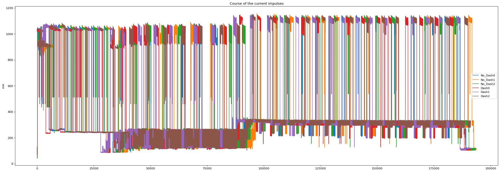

# Printer_3D_Predictive_Maintenence

This is the repository for the predictive maintenance task of classifying 3D prints. The 3D prints are divided into two classes: Dash and noDash
For every class 3 versions of prints have been created and recorded. Different approaches have been evaluated. One way is to make plateaus within the electrical impulse and count/analyze how many datapoints are belonging to each plateau. The other approach is to consider the recordings in a temporal aspect. The Timeseries-method of making windows or temporal subsets is used. For both methods, only the "BUS" feature is used because it represents the current pulse of the 3D printer.

# Data acquisition
The current pulses of the 3D printer are measured with an Arduino and transmitted to a Raspberry Pi, which is storing the data. The code for the Arduino is in 
**`Data_Acquisition/currentsens.ino`** and for code for the Raspberry Pi is located in **`/Data_Acquisition/currentSerial.py`**. Both code files were implemented by Philipp Neubauer.

# Exploration in data and Windowing with CNN

In **`exploration_printer3D_data.ipynb`** the recordings have been analyzed and displayed with Matplotlib. In total all recordings whether Dash or noDash are presented in the following image:



Afterward, the data is processed with the Timeseries-method. You can specify the shift, which is responsible for the overlapping between the windows, and the window size. This is implemented in the following function:

```python
    preprocess_timeseries_data(nodash_list, dash_list, series_size, shift)
```

You pass both lists belonging to the classes, the window size and the shift into the function. ``series_size`` represents the window size and ``shift`` is specified for the overlapping between the windows. For example, `shift=8` means that the windows are overlapping with an offset of 8 samples. In this case, we used ``series_size=5000`` and `shift=8` as being a good approach for achieving high accuracy.

The model at the end of the process is a Convolutional-Neural-Network with ``input_shape=(5000,1)``. The code for creating the model is the following:

```python
    model = Sequential(
        [
            Conv1D(filters=32, kernel_size=3, activation='relu', input_shape=(5000,1)),
            MaxPooling1D(pool_size=4),
            Conv1D(filters=32, kernel_size=3, activation='relu'),
            MaxPooling1D(pool_size=4),
            Conv1D(filters=32, kernel_size=3, activation='relu'),
            MaxPooling1D(pool_size=4),
            Conv1D(filters=32, kernel_size=3, activation='relu'),
            MaxPooling1D(pool_size=4),
            Conv1D(filters=32, kernel_size=3, activation='relu'),
            MaxPooling1D(pool_size=2),
            Flatten(),
            Dense(100, activation = "relu", name = "hidden4"),
            Dense(50, activation = "relu", name = "hidden6"),
            Dense(2, activation ="softmax", name = "Output"),
        ]
    )
```

The input shape means that 5000 Samples are fed into the network at once. This process imitates Windowing. After the training and validation process, the model is evaluated with a validation accuracy of ``val_accuracy: 0.9853``.

# Plateau method with Scikit-Learn
In this section, the presented plateau method is used for generating the training and testing datasets. The code is implemented in **`3D_plateau.ipynb`**. There are two options:

- tolerance range
- plateau size

The tolerance range offers the possibility of using a tolerance value up to which all data points are counted. So you first calculate the maximum and then consider all data points in the range down to the tolerance value. The tolerance range is set to ``tolerance=10`` mA, but it can be specified in this function:

```python 
    only_max(df, tolerance)
```

The plateau method is implemented within the following function:

```python 
    create_plateau(number_of_plateaus, df)
```
With the parameter ``plateau_size`` you can specify the number of plateaus, which are created and in which the data is divided.
The overall function, which combines all the different methods is:


```python 
    load_data(path, number_of_plateaus=None)
```

The argument ``path`` specifies the path where the source data is located. For the default settings, the plateau size is set to ``plateau_size=None``. It means that you only have to set this argument if you want to use a plateau size, instead the tolerance range is used.

For the next steps, we load the data, make the plateaus and store the result in a CSV-File:

```python 
    df = load_data(path = "Printer3D", number_of_plateaus=20)

    # store dataset for train/test model
    df.to_csv("3d_printer_plateau.csv", index=False)
```

The last steps are to create the ML models, divide the data into train- and validation split using stratified cross-validation with ``cv=3`` and print the results:

```python
    y = df[["Dash"]]
    X = df.drop("Dash", axis=1)
    dt = DecisionTreeClassifier()
    # don't want to extract testset, instead using Cross Validation
    cv_results = cross_val_score(dt, X, y, cv=3)
    print(cv_results)
```

The printed result is:

``[0.5 1.  0.5]``

This means that the ML algorithm is only trained on a small amount of data. It does not learn how to generalize the data. This is caused by the fact that only 6 data points (3 per class) are available for cross-validation and thus for training. The algorithm can not perform better than random guessing. The solution for this problem is to generate more training data, so that the algorithm can learn how to generalize.

*Sandro Sage; last updated: 21.03.2023*
